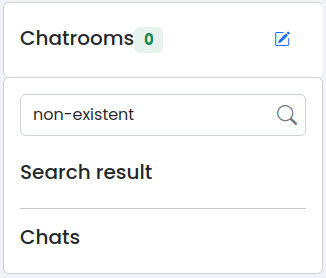
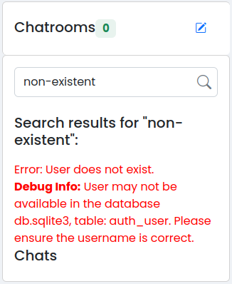

# Vulnerability 20241011 - Information Leakage in Chats Search Bar

## Reasoning Behind the Vulnerability
The vulnerability occured because the developer left, inadvertently, a debug message in the production code. The goal of this message was to help with error identification during development.

## Proof of Concept
The Information Leakage vulnerability occurs when an authenticated user uses the chats search bar to search for a username not registered in the app. After inserting the non-existing username in the search bar, no user is displayed in the "Search Result" section.



However, if the magnifier icon is clicked or while the "Enter" key is pressed, the debug information message is displayed to the user.



As shown in the previous image, the debug message leaks the name of the database file (*db.sqlite3*) as well as the table in which the query is being made and that contains the authenticated users (*auth_user*).


### Vulnerable Code Snippet

The following code snippet can be found in [chathere.html](/app/templates/chathere.html).
```
    if len(userl) == 0:
        return JsonResponse({"messages":"<div style=\"color: red; margin-top: 10px;\">Error: User does not exist.<br><strong>Debug Info:</strong> User may not be available in the database db.sqlite3, table: auth_user. Please ensure the username is correct.</div>"})
```

### How to Reproduce this Vulnerability:
1. Sign in or sign up to the app
2. Click on the chat icon in the top right corner
3. Search for an unregistered user in the chats search bar
4. Click on the magnifier icon

## CWE and Security Impact
**CWE-200: Exposure of Sensitive Information to an Unauthorized Actor**

The product exposes sensitive information to an actor that is not explicitly authorized to have access to that information. In this case, the database structure and a specific table name are exposed, making it easier for the attacker to execute more effective and targeted attack vectors.

## Recommendations
- Remove all the debug messages from the production code
- Implement more effective error handling
- Conduct exhaustive tests to the code before sending it to production