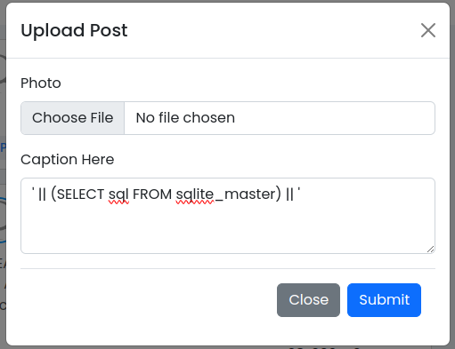
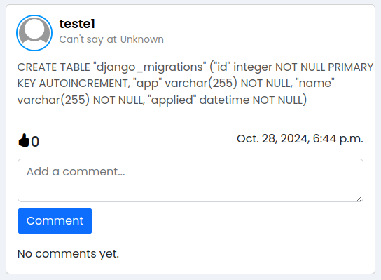
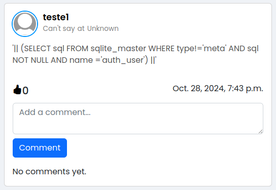

# Vulnerability 20241028 - String Based SQL Injection in "New Post" Modal

## Reasoning Behind the Vulnerability
While in the development phase, one of the junior developers created a condition in the upload post function to execute a query in order to easily obtain information about the "django_migrations" table's attributes and data types. Although he hadn't thought about it, this unsafe piece of code created the perfect conditions to execute a SQL Injection.

## Proof of Concept
The vulnerability occurs when an authenticated user introduces the string **' || (SELECT sql FROM sqlite_master) || '** in the "Caption Here" textarea situated in the "New Post" modal.

First, the authenticated user clicks on the "New Post" span.


Then, he inputs a String Based SQL Injection like the one in the image below and uploads the post.



The output given after the upload shows information about the "django_migrations" table, revealing every attribute name and data type. This sensible information will be available for every user since it was published in the attacker's profile.




Note that other types of SQL Injections were tested in order to fully assess the vulnerability, but no other was found. The output from those tests was similar to the one shown below.




### Vulnerable Code Snippet

The following code snippet can be found in [views.py](/app/back/views.py).
```
@login_required(login_url="signin")
def upload(request):
    if request.method == "POST":
        user = request.user.username
        image = request.FILES.get("uphoto")
        image_path = image.name if image else ""
        caption = request.POST.get("caption")
        post_id = str(uuid.uuid4())
        current_time = datetime.now().strftime("%Y-%m-%d %H:%M:%S")

        # Unsafe query condition. Delete in production!
        if caption.replace(" ", "") == ("'||(SELECTsqlFROMsqlite_master)||'"):
            sql = f"""
                INSERT INTO back_post (id, user, image, tam, likes, caption)
                VALUES ('{post_id}', '{user}', '{image_path}', '{current_time}', 0, '{caption}')
            """
            with connection.cursor() as cursor:
                cursor.execute(sql)
        else:
            new_post = Post.objects.create(user=user, image=image, caption=caption)
            new_post.save()

        return redirect("/")
    else:
        return render(request, "upload.html")
```

### How to Reproduce this Vulnerability:
1. Sign in or sign up to the app
2. Click on "New Post" under the profile information
3. Introduce a string based sql injection exactly like **' || (SELECT sql FROM sqlite_master) || '** in the "Caption Here" textarea
4. Click on the "Submit" button

## CWE and Security Impact
**CWE-89: Improper Neutralization of Special Elements used in an SQL Command ('SQL Injection')**

The product constructs all or part of an SQL command using externally-influenced input from an upstream component, but it does not neutralize or incorrectly neutralizes special elements that could modify the intended SQL command when it is sent to a downstream component. Without sufficient removal or quoting of SQL syntax in user-controllable inputs, the generated SQL query can cause those inputs to be interpreted as SQL instead of ordinary user data. 

## Recommendations
- Sanitize every user input in order to execute safe queries
- Review the code before sending to the production phase 
- Conduct exhaustive tests (manual and automated) to the code before sending it to production