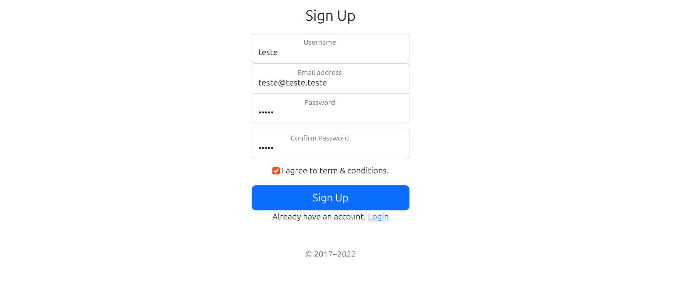
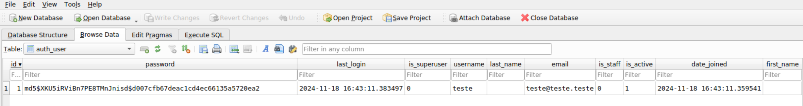

# Vulnerability 20241122-1 - Cryptographic Failure in password storage

## Reasoning Behind the Vulnerability

To prioritize performance, the team leader in its obsession decides to hash and store passwords using the outdated MD5 algorithm without thoroughly evaluating its security limitations. This poor decision is carried forward into the development of the password management service, perpetuating a significant security risk.

## Proof of Concept
The vulnerability is present when a user creates an account on the web platform and the details of that account are stored on the SQLite database.

First the user creates an account by inputing the details and clicking "Sign Up":



Then the details are stored in the database. Note how the password is stored as a salted md5 hash.




### Vulnerable Code Snippet

The vulnerable code snippet can be found in [settings.py](/app/project/settings.py).
```
PASSWORD_HASHERS = [
    "django.contrib.auth.hashers.MD5PasswordHasher",
]
```

This enforces Django to use the MD5PasswordHasher for authentication.

### How to Reproduce this Vulnerability:
1. Go to the sign up page
2. Input valid account details
3. Click "Sign Up" to create an account

## CWE and Security Impact
**CWE-327: Use of a Broken or Risky Cryptographic Algorithm**

The product uses a broken or risky cryptographic algorithm or protocol.

Although the implementation incorporates salting to mitigate certain attacks like rainbow table lookups, MD5 remains fundamentally insecure due to its cryptographic vulnerabilities.

MD5 suffers from significant flaws, including vulnerabilities to collision attacks, where two different inputs produce the same hash output, that makes it unsuitable for protecting sensitive data like passwords, as attackers can exploit these vulnerabilities to compromise the integrity of the hashed data.

Moreover, MD5's computational speed, which was once an advantage, now makes it highly susceptible to brute-force and dictionary attacks. If an attacker gains access to the salted password hashes, they can still use modern GPU-powered tools to brute-force or reverse the hashes in a relatively short time.

## Recommendations
- Replace MD5PasswordHasher with a cryptographically secure password storage algorithm like PBKDF2-SHA256, in Django's PBKDF2PasswordHasher, or Argon2 (winner of the Password Hashing Competition), in Argon2PasswordHasher. Django's default parameters for these algorithms are industry recommended but can also be reconfigured.