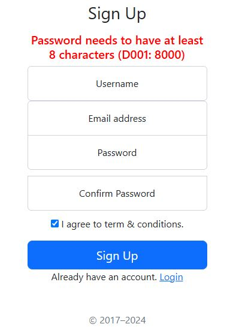
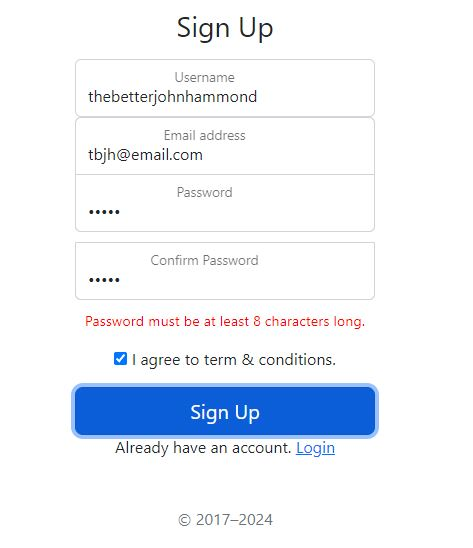
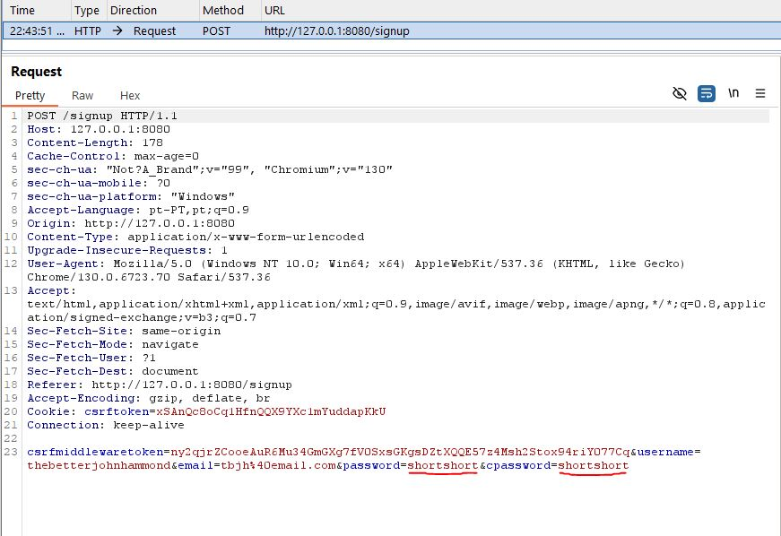

# Vulnerability 20241122-2 - Information Leakage

## Background - Password Management Service

This background will serve to contextualize this vulnerability and vulnerability 20241122-3.

Recent massive password data breaches happening across the industry sew concern among the development project's stakeholders and its product owners. Without a solid understanding of the underlying vulnerabilities behind these breaches, the stakeholders put pressure on the development team to find a relatively low-cost and guaranteed "silver bullet" to mitigate a password breach. Unacquainted with cybersecurity best practices, the development team decides to undergo a password migration to a reputable third-party database service, outsourcing the security know-how. However, before any migration is done, the development team needs to adapt their application to handle and fetch from an external service. To test and validate this functionality, they hand-craft a temporary password management service.

They make sure this service can only be reached by any entity in the internal backend network shared with the main backend server.

### Design & Implementation

The password management service is implemented as an additional process in the deployment Dockerfile. It's implemented using FastAPI and uses an SQLite database to store rows of passwords with unique IDs to be referenced by a user. See /password-service for code.

This password service uses MD5 hashing with no salting, presenting the same cryptographic failure vulnerability as in the Django backend's (/app) own password storage. 

The password service exposes a basic CRUD API for **any** internal network entity to use. It employs no authentication or authorization mechanisms. This CRUD API is also poor in terms of secure design, as it unnecessarily exposes every single password for explicit reading, e.g. reading all database passwords. The application backend should not be able to have this many priviledges since, in practice, it only needs the ability to upload passwords and check password existence to authenticate users.

### Backend integration

The backend (/app) has yet to fully integrate or use this service, currently only uploading the passwords of new users (signing up) to be stored in a hashed format on the password management service. Passwords are still hashed and stored locally on the backend server, leading to duplication.

The hypothetical developers behind this project deemed the necessary changes to the User model for authentication using the password service to be too drastic mid-project, leading them to only release this simple functional increment for now.

## Reasoning Behind the Vulnerability

The following vulnerability follows up on the background as an inexperienced developer is trying to integrate the password service's storage into the "sign-up" logic. Frustrated, they do thorough debugging and printing of variables. The developer succeeds, but they forget to clean up a particular debug error message that is displayed to the client under specific conditions. A fault manifests as a result of carelessness.

## Proof of Concept
The vulnerability presents itself during the "sign-up" process at the /signup page as an error message only returned when a submitted password is invalidated at the backend, which, under normal user interaction, should only happen when the frontend validation code fails to invalidate the password (e.g. it was never triggered, was removed or suffered a runtime error). An attacker may prefer forging a request.



### Vulnerable Code Snippet

The vulnerable code snippet can be found in [views.py](/app/project/views.py) under the signup function.
```python
elif len(password) < 8:
    messages.info(request, f"Password needs to have at least 8 characters (D001: {settings.PASS_SERVICE_PORT})")
```
This piece of code handles the particular case for an insufficiently long password, leaking the port number (environment variable) for the password service in the returned error message.

### How to Reproduce this Vulnerability:

Under normal circumstances, frontend code will prevent an invalid password from being created ("invalid" passwords are passwords under 8 characters long):



However, if a sign-up form request is forged, it easily bypasses this and subsequently triggers the backend password validation control, returning the sign-up page with an error message embedded.


1. Using Burp Suite Community Edition's Proxy (on localhost:8070), the POST form request is intercepted when submitting a valid password:



2. The password is modified to be invalid, by truncating it to "short" on both respective parameters:


3. Upon forwarding the request, the following page is returned on the proxied browser instance:


## CWE and Security Impact
**CWE-200: Exposure of Sensitive Information to an Unauthorized Actor**

This error message leaks the port number of the password service (8000). While it's a small ambiguous detail, its risk is not to be underestimated as it can greatly facilitate exploitation using other vulnerabilities.

To show this, an exploit chain formed using vulnerabilities 20241122-1 and 20241122-3 is shown in the latter's report.

## Recommendations
- Remove all debug messages from production code 
- Use appropriate debugging tools and logging 
- Submit all production code pull requests (incoming changes) to multiple code reviews 
- Consider error messages in front-end tests