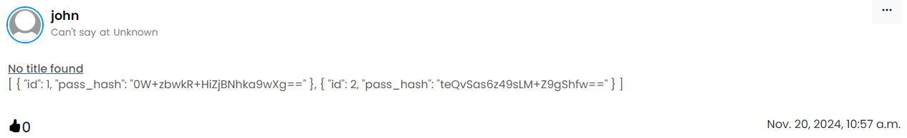
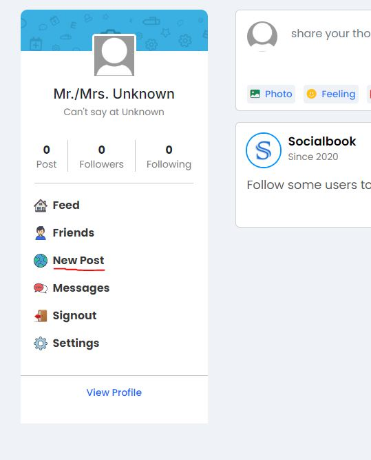
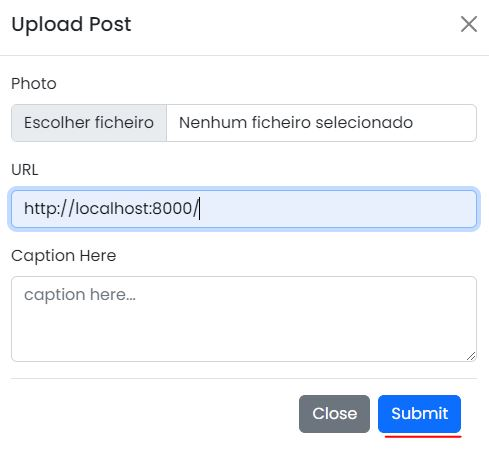

# Vulnerability 20241122-3 - Server Side Request Forgery

## Reasoning Behind the Vulnerability

A new URL preview feature has been implemented and deployed, allowing users to have a preview of a specific website's contents to be rendered on their post. The feature is implemented to accept HTML, JSON and plain text resources, accounting for the large developer demographic on the website (so much Javascript and SQL being posted!).

Users can submit a URL for the website they wish to preview, but a question lingers: can it preview **every** website and remote resource, even those the user shouldn't be able to see? Indeed it can.

The developers failed to consider the level of access offered by this feature and now any user can submit **any** URL for the server to fetch (HTTP GET).

## Proof of Concept
The vulnerability is present during post creation, when a user submits a preview URL for a resource it should not have access to. The post is created and displays part of the contents pointed by the URL.



Using the new password management service as an example (read report on vulnerability 20241122-2), there are no controls stopping the user from simply inputting a valid URL to an endpoint on this service (another process alongside the backend server), allowing them to query for all password hashes. 

### Vulnerable Code Snippet

The vulnerable code snippet can be found in [views.py](/app/project/views.py) under the upload function.
```python
if url:
    try:
        headers = {
            "Access-Control-Allow-Origin": "*",
            "Access-Control-Allow-Methods": "GET",
            "Access-Control-Allow-Headers": "Content-Type",
            "Access-Control-Max-Age": "3600",
            "User-Agent": "Mozilla/5.0 (X11; Ubuntu; Linux x86_64; rv:52.0) Gecko/20100101 Firefox/52.0",
        }
        response = requests.get(url, headers=headers, timeout=5)
        content_type = response.headers.get("Content-Type", "").lower()
    ...
    ...
```
The entire block handling URL previewing (beyond this snippet) can be considered vulnerable as it implements no input value restrictions and access controls.

### How to Reproduce this Vulnerability:

In order to fully demonstrate this vulnerability's potential risk, it will be reproduced using the new password service as the asset under attack.

(OPTIONAL) Reproduce vulnerability 20241122-2 to obtain the password service's port number
1. On the leftmost bar of the main page, select the "New Post" option



2. As the post's URL preview, input a valid URL pointing to the password service's root endpoint (e.g. localhost:8000)



3. Click the "submit" button

4. View your own post on the main page

5. It should now contain the JSON response body for the password service's root endpoint, listing a number of password hashes.


(OPTIONAL) Knowing vulnerability 20241122-1 the hashes are vulnerable to "cracking" attacks. Obtain the plaintext passwords by performing well-known attacks on unsalted MD5 hashes.


## CWE and Security Impact
**CWE-918: Server-Side Request Forgery (SSRF)**

With the optional steps for vulnerability reproduction included, this forms an exploit chain that can lead to a major data breach and authentication/authorization compromise.

Outside the context of the password service, this vulnerability can lead to further information leaks by querying additional network processes and services. This exploits the authenticity and access priviledges of the server to circumvent external network protections (e.g. firewalls) and obtain confidential information, such as user and administrative credentials among other application data. 

## Recommendations
- Define an allow-list and deny-list for queryable resources using the preview feature
- Revaluate component priviledges and apply the principle of least-priviledge to system components
- Use SAST (Static Application Security Testing) to detect other future instances
