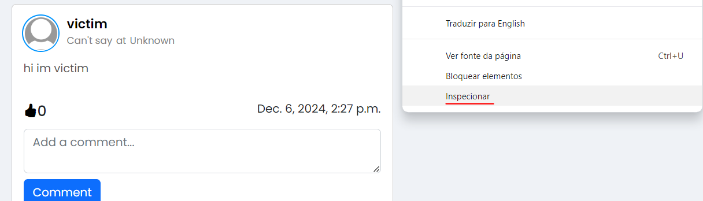
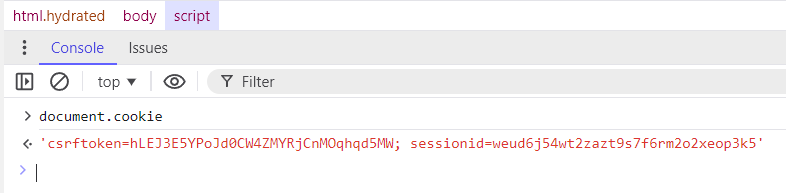

# Complementary information - HttpOnly 

The following reports on a misconfiguration which we **do not classify as a vulnerability** on its own, but can be abused when exploiting another vulnerability.

This document serves to complement the reported vulnerability for delivery number 4.

## Reasoning Behind the Vulnerability

A developer from our hypothetical development team was trying to debug a hidden session management misconfiguration, leading them to disable the HttpOnly configuration for cookie sharing on browsers. At 3 AM, this developer was exhausted from hours of debugging and didn't revert every debug-related change: the disabled HttpOnly flag, which was pushed to production.

## Proof of Concept
The vulnerability is present throughout the entire web application in the form of a "sessionid" cookie with a disabled HttpOnly flag, allowing scripts on the client's browser to read the cookie.

### Vulnerable Code Snippet

The vulnerable code snippet can be found in [settings.py](/app/project/settings.py) at line 59.
```python
SESSION_COOKIE_HTTPONLY = False
```
This setting disables the HttpOnly flag for cookies.

### How to Reproduce this Vulnerability:

Reproducing this vulnerability is as simple as using the browser's developer tools to call `document.cookie` on any page served by the web application, after authenticating yourself as a website user.

1. Sign-in as an existing user.

2. Open the browser's developer tools by using the "Inspect" functionality.



3. Open the dev tools console, write `document.cookie`, press enter to execute and observe the returned values.



With the HttpOnly flag enabled, only the "csrftoken" cookie should be returned, but with this flag disabled, this cookie, alongside the "sessionid" cookie, should be returned.

This vulnerability is best exploited with XSS, which is demonstrated in vulnerability 20241206-2 (Cross-Site Scripting).

## CWE and Security Impact
**CWE-1004: Sensitive Cookie Without 'HttpOnly' Flag**

Disabling the HttpOnly flag for a sensitive cookie such as "sessionid" (used for user session management) will allow browser scripts to access the cookie, potentially including malicious scripts, such as those injected via Cross-Site Scripting (XSS).

These malicious scripts may be able to exfiltrate the "sessionid" cookie, perform session hijacking to bypass other existing authentication mechanisms and obtain the victim's access controls. 

## Recommendations
- Enable the HttpOnly flag by removing the settings.py override entirely (Django enables this flag by default). This measure is highly effective in most browser scripting engines [CWE-1004](https://cwe.mitre.org/data/definitions/1004.html).
