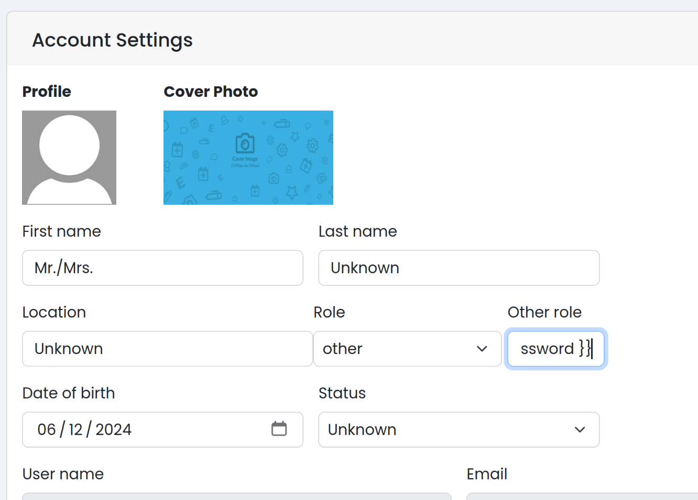
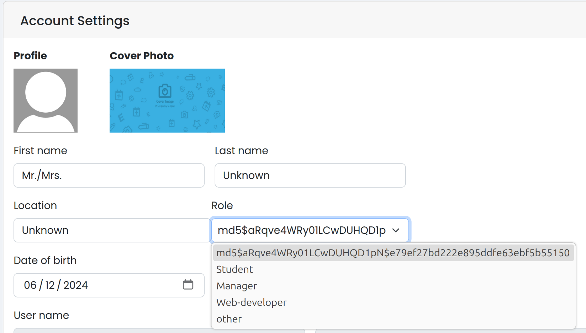
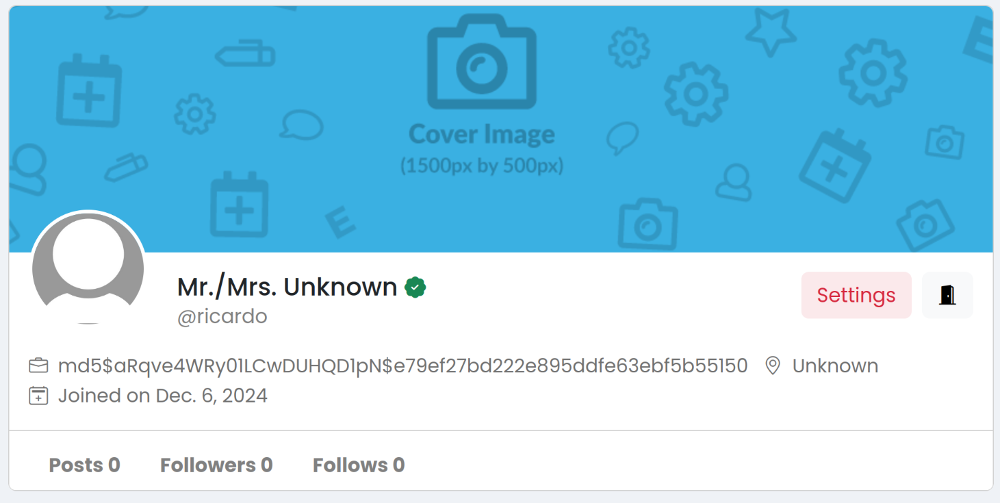

# Vulnerability 20241206 - Server Side Template Injection in Profile Settings

## Reasoning Behind the Vulnerability

During the development of the profile management feature, the team leader insisted on implementing a dynamic "Other Role" feature, enabling users to define their own roles in the system. To achieve this, the developer with this task, in the haste to meet deadlines, decided to use a templating engine to process user input directly and giving it the user context, thinking it was the correct way of doing it.

This decision was made without proper evaluation of the risks associated with processing untrusted input, and it was under the assumption that users would not be capable to exploit the system this way.

## Proof of Concept
The vulnerability is present when a user navigates to the profile settings page and in the Role dropdown chooses other, which allows the user to input their "custom" role in the Other Role text box that appears.

Then, the user can take advantage of the fact that the user context is accessible to input things like {{ user.password }} to get the hash of its password:



When the user hits Enter, we can see that the password hash is presented.



The vulnerable "other role" will also be visible in other pages, like in the profile page, therefore making the password hash accessible, not only to the owner of the password, but to other users as well:



### Vulnerable Code Snippet

The vulnerable code snippet can be found in [views.py](/app/project/views.py).
```python
@login_required(login_url="signin")
def psettings(request):
    user_profile = Profile.objects.get(user=request.user)

    if user_profile.mail_verification == False:
        return redirect("/mail_verification")

    if request.method == "POST":
        bio = request.POST["bio"]
        fname = request.POST["fname"]
        lname = request.POST["lname"]
        location = request.POST["location"]
        role = request.POST["role"]
        status = request.POST["status"]
        dob = request.POST["dob"]
        # birthday=request.POST['birthday']

        if role == "other":
            other_role = request.POST.get("changed", "")
            
            try:
                template = Template(other_role)
                rendered_role = template.render(Context({"user": request.user}))
                role = rendered_role
            except Exception as e:
                role = f"{other_role}"

        user_profile.bio = bio
        # user_profile.birthday=birthday
        user_profile.lname = lname
        user_profile.fname = fname
        user_profile.role = role
        user_profile.dob = dob
        user_profile.status = status
        user_profile.location = location
        user_profile.save()

        return redirect("/psettings")

    return render(request, "psetting.html", {"user_profile": user_profile})
```

As we can see, the developer chose to make a Template for role when it is "other" and render it with the Context of the user. The injection will only work in that context, as in any other context it will trigger the exception and just print out the role as it was written, making this vulnerability hard to detect.

### How to Reproduce this Vulnerability:
1. Log In
2. Go to the profile settings page
3. Choose other in the Role dropdown
4. Input {{ user.password }} or other form of injection in the user context
5. Hit Enter

## CWE and Security Impact
**CWE-1336: Improper Neutralization of Special Elements Used in a Template Engine**

The product uses a template engine to insert or process externally-influenced input, but it does not neutralize or incorrectly neutralizes special elements or syntax that can be interpreted as template expressions or other code directives when processed by the engine.

While Django typically includes safeguards to neutralize user input in templates, these protections were bypassed because the developer explicitly used the **Template** and **Context** classes to deal with user input. By doing so, the developer circumvented Django's built-in mechanisms for escaping and validating user-supplied data, exposing the application to potential exploitation.

## Recommendations
- Avoid rendering user input directly:
    - Developers don't need to create a Template and give it a Context to handle the rendering of user inputs, such as in the "Other role" component, as it's already done __safely__ by the use of Django's built-in render function at the end.
        
        ```return render(request, "psetting.html", {"user_profile": user_profile})```