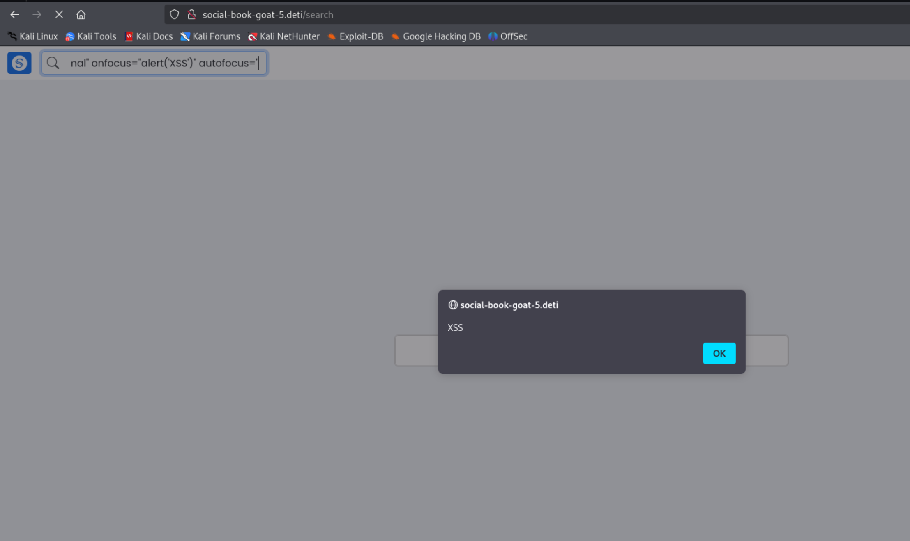

# Cross Site Scripting

## Group 1

### Description

The vulnerability occurs when an authenticated user injects a malicious XSS payload in the Upload Post's textbox.
In order for the payload to be effective, it needs to have more than 500 chars and the script must be encoded in UTF-8 format.

A valid example would be a script to generate an alert.
The usual payload would look like this:

`<script>alert(1)</script>`

And the encoded payload would be the following:

`%3C%73%63%72%69%70%74%3E%61%6C%65%72%74%28%31%29%3C%2F%73%63%72%69%70%74%3E`

### Proof of Concept

1. Input the malicious payload and submit the post:

`AAAAAAAAAAAAAAAAAAAAAAAAAAAAAAAAAAAAAAAAAAAAAAAAAAAAAAAAAAAAAAAAAAAAAAAAAAAAAAAAAAAAAAAAAAAAAAAAAAAAAAAAAAAAAAAAAAAAAAAAAAAAAAAAAAAAAAAAAAAAAAAAAAAAAAAAAAAAAAAAAAAAAAAAAAAAAAAAAAAAAAAAAAAAAAAAAAAAAAAAAAAAAAAAAAAAAAAAAAAAAAAAAAAAAAAAAAAAAAAAAAAAAAAAAAAAAAAAAAAAAAAAAAAAAAAAAAAAAAAAAAAAAAAAAAAAAAAAAAAAAAAAAAAAAAAAAAAAAAAAAAAAAAAAAAAAAAAAAAAAAAAAAAAAAAAAAAAAAAAAAAAAAAAAAAAAAAAAAAAAAAAAAAAAAAAAAAAAAAAAAAAAAAAAAAAAAAAAAAAAAAAAAAAAAAAAAAAAAAAAAAAAAAAAAAAAAAAAAAAAAAAAAAAAAAAAAAAAAAAAAAAAAAAAAAAAAAAAAAAA%3C%73%63%72%69%70%74%3E%61%6C%65%72%74%28%31%29%3C%2F%73%63%72%69%70%74%3E`

2. Verify that an alert was displayed:


### Impact

Through this vulnerability, malicious scripts could be executed in any users' browser if the person follows the attacker and the XSS can be used to create malicious links that lead other users to phishing pages or to malware injection. The vulnerability can also compromise session cookies, allowing the attackers to impersonate other users.

### CVSS

**Overall Score:** 8.8

**Vector:** AV:N/AC:L/PR:N/UI:R/S:C/C:H/I:L/A:L


### CWE

**CWE-79: Improper Neutralization of Input During Web Page Generation ('Cross-site Scripting'):** The product does not neutralize or incorrectly neutralizes user-controllable input before it is placed in output that is used as a web page that is served to other users.

**CWE-80: Improper Neutralization of Script-Related HTML Tags in a Web Page (Basic XSS):** The product receives input from an upstream component, but it does not neutralize or incorrectly neutralizes special characters such as "<", ">", and "&" that could be interpreted as web-scripting elements when they are sent to a downstream component that processes web pages.

### Recommendations

- Implement character escaping libraries
- Sanitize inputs that contain executable scripts and HTML tags

## XSS group 5

### Description

The vulnerability is present in two places.

The first is when a user searches for something using the endpoint **/search**. The search parameter is used as the placeholder when the page reloads as shown in the next image:


This allows Cross-Site scripting, as demonstrated by searching with: ```normal" onfocus="alert('XSS')" autofocus=```, which results in the alert being executed:




There is also XSS at the profile page when a user has 2 or more posts and one of them, except the first one, is something like ```<script>alert("XSSSS")</script>```.
Here we can see that the user has two posts:


And when we go to the **profile page** the result is that the alert is executed.


The payload will also be executed when other users visit the profile, which makes the impact much larger.

### Impact

In the case of the search endpoint, attackers can exploit this vulnerability by crafting a malicious link containing a injected payload in the search parameter, which allows them to steal session tokens, cookies or other sensitive information.

In the context of the XSS on the profile page, an attacker creates a malicious profile post containing JavaScript and when any user, including high-privilege users (admins), views the profile page, the malicious script is executed in their browser. This could compromise their session, leading to further exploitation.


### CVSS

**Score:** 8.8

**Vector:** AV:N/AC:L/PR:N/UI:R/S:C/C:H/I:L/A:L


### CWE

**CWE-79: Improper Neutralization of Input During Web Page Generation ('Cross-site Scripting'):** The product does not neutralize or incorrectly neutralizes user-controllable input before it is placed in output that is used as a web page that is served to other users.

**CWE-80: Improper Neutralization of Script-Related HTML Tags in a Web Page (Basic XSS):** The product receives input from an upstream component, but it does not neutralize or incorrectly neutralizes special characters such as "<", ">", and "&" that could be interpreted as web-scripting elements when they are sent to a downstream component that processes web pages.

### Recommendations

- Encode the placeholder attribute using an appropriate escaping function.
- Validate all user input on both the client and server sides to ensure it conforms to expected formats.
- Reject or sanitize inputs containing patterns such as HTML tags, JavaScript code or other executable scripts.
- Utilize Django's secure libraries for escaping characters.


## Group 6

### Description

The vulnerability occurs when an authenticated user injects a malicious XSS payload in the Upload Post's Caption Here textbox.

### Proof of Concept

1. Input the malicious payload and submit the post:


2. Click on the link generate by the malicious payload:


3. Observe that you were redirected to another website (Group 1's Website, in this case)


### Impact

Through this vulnerability, malicious scripts could be executed in any users' browser if the person follows the attacker and the XSS can be used to create malicious links that lead other users to phishing pages or to malware injection. The vulnerability can also compromise session cookies, allowing the attackers to impersonate other users.

### CVSS

**Score:** 8.8

**Vector:** AV:N/AC:L/PR:N/UI:R/S:C/C:H/I:L/A:L


### CWE

**CWE-79: Improper Neutralization of Input During Web Page Generation ('Cross-site Scripting'):** The product does not neutralize or incorrectly neutralizes user-controllable input before it is placed in output that is used as a web page that is served to other users.

**CWE-80: Improper Neutralization of Script-Related HTML Tags in a Web Page (Basic XSS):** The product receives input from an upstream component, but it does not neutralize or incorrectly neutralizes special characters such as "<", ">", and "&" that could be interpreted as web-scripting elements when they are sent to a downstream component that processes web pages.

### Recommendations

- Implement character escaping libraries
- Sanitize inputs that contain executable scripts and HTML tags


## XSS group 7

### Description

This XSS can be observed in the comments of a post, which is an extra feature of this social network. A simple payload sufices: ```<script>alert("First comment");</script>```


The result when the comment is submitted is the alert script being executed:


It will also execute in the profile page and for other users who see the post.

### Impact

The vulnerability allows an attacker to inject and execute arbitrary JavaScript code in the following scenarios:

1. In the Comments Section:
    - The malicious script executes immediately upon submission of the comment.

2. On the Profile Page:
    - The script executes whenever a user views the profile page containing the affected post. This extends the impact to other users, including high-privilege users like administrators, potentially leading to session hijacking or unauthorized actions.

3. For Other Users Who Follow Viewing the Post in Homepage:
    - Any user who follows views the post in the homepage and sees the malicious script executed in their browser, potentially exposing sensitive data such as cookies or session tokens.


### CVSS

**Score:** 8.8

**Vector:** AV:N/AC:L/PR:N/UI:R/S:C/C:H/I:L/A:L


### CWE

**CWE-79: Improper Neutralization of Input During Web Page Generation ('Cross-site Scripting'):** The product does not neutralize or incorrectly neutralizes user-controllable input before it is placed in output that is used as a web page that is served to other users.

**CWE-80: Improper Neutralization of Script-Related HTML Tags in a Web Page (Basic XSS):** The product receives input from an upstream component, but it does not neutralize or incorrectly neutralizes special characters such as "<", ">", and "&" that could be interpreted as web-scripting elements when they are sent to a downstream component that processes web pages.

### Recommendations

- Validate all user input on both the client and server sides to ensure it conforms to expected formats.
- Reject or sanitize inputs containing patterns such as HTML tags, JavaScript code or other executable scripts.
- Utilize Django's secure libraries for escaping characters.