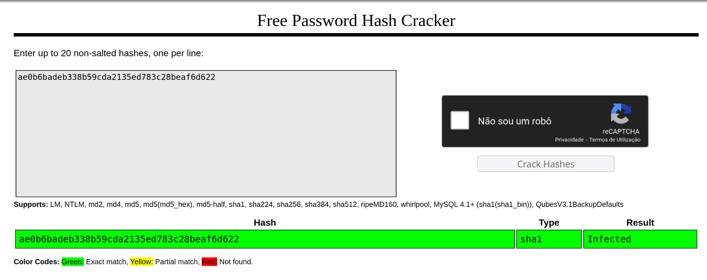
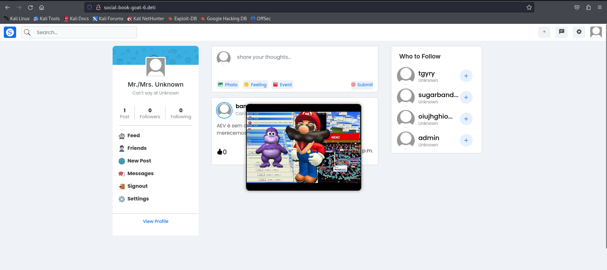
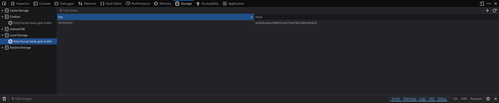
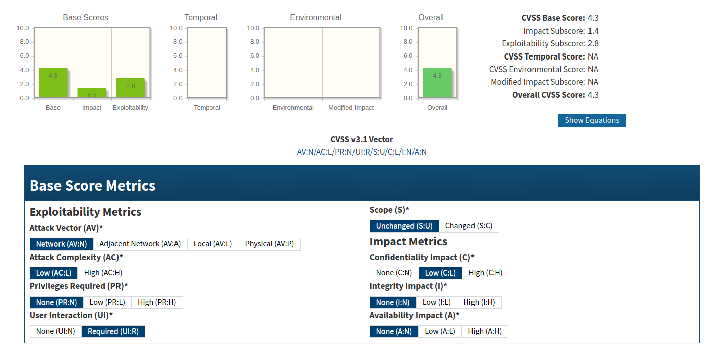

# Cryptographic failure

## Group 6

### Description

The vulnerability is found by claiming the lottery prize in the endpoint **/lottery**, which "infects" our computer. This then transforms the sessionID stored in the **local storage** to a hash that is SHA-1, a vulnerable digest function.

Cracking the hash can be done, for example, using a tool like https://crackstation.net/, which shows the hash is of the word "Infected".

You can also verify it in a tool like CyberChef by transforming "Infected" into a SHA-1 hash using 80 rounds: https://gchq.github.io/CyberChef/#recipe=SHA1(80)&input=SW5mZWN0ZWQ

### Proof of Concept

1. After login, head to /lottery and "Claim your prize":

After this, you an alert will appear and you will be redirected to the homepage, where popup's are going to be shown. 

2. Go to SESSIONID in the **local storage** dev tools, which will have the vulnerable SHA-1 cookie.

### Impact

In the context of this application, the real impact of the vulnerability is that allow us to know the number of rounds that were used in this cookie encryption. 
This is a start point to speed up other SHA-1 contents decipher process, which can be more critical and lead to more serious problems.

### CVSS

**Overall Score:** 4.3

**Vector:** AV:N/AC:L/PR:N/UI:R/S:U/C:L/I:N/A:N

### CWE

**CWE-328: Use of Weak Hash:** The product uses an algorithm that produces a digest (output value) that does not meet security expectations for a hash function that allows an adversary to reasonably determine the original input (preimage attack), find another input that can produce the same hash (2nd preimage attack), or find multiple inputs that evaluate to the same hash (birthday attack).

**CWE-916: Use of Password Hash With Insufficient Computational Effort:** The product generates a hash for a password, but it uses a scheme that does not provide a sufficient level of computational effort that would make password cracking attacks infeasible or expensive.

### Recomendations

- Not have content that has nothing to do with the scope of the application

- Use cryptographic secure digest functions