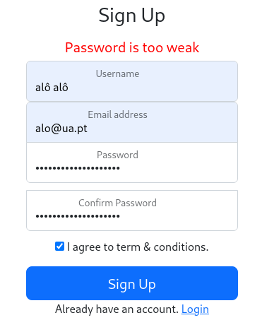
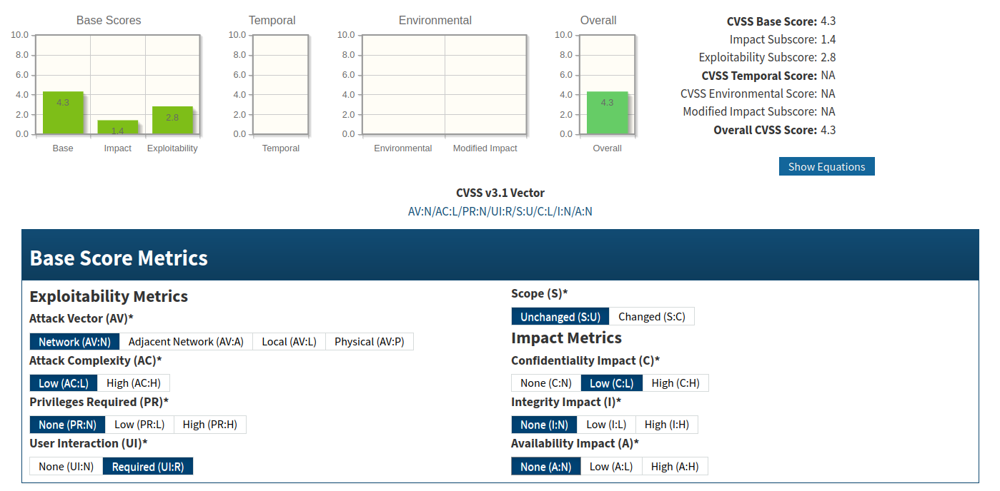

# Identification and Authentication Failures

# Group 6

### Description

The app fails to properly validate passwords during account creation. Strong, randomly generated passwords are classified as "too weak," while weak passwords such as "1234" are accepted.

### Proof of Concept

1. Attempt to create a new account with a strong, randomly generated password such as `f*4Es3&ioHCGzkf2T#!$`.

2. A message saying the password is too weak is displayed:

3. Create an account with a password like `1234` and observe that no error is displayed and the account is successfully created.

### Impact

The password validation mechanism does not comply with robust password policies, which increases the risk of unauthorized access to other users' accounts through brute force attacks.

### CVSS

**Overall Score:** 4.3

**Vector:** AV:N/AC:L/PR:N/UI:R/S:U/C:L/I:N/A:N

### CWE

- **CWE-521 Weak Password Requirements:** The product does not require that users should have strong passwords, which makes it easier for attackers to compromise user accounts.

- **CWE-647 Improper Password Strength Validation:** The product defines policy namespaces and makes authorization decisions based on the assumption that a URL is canonical. This can allow a non-canonical URL to bypass the authorization.

### Recommendations

- Implement a robust password validation (minimum and maximum character counts, uppercase and lowercase letter requirements, numeric and special character requirements, time-based password resets, password re-use policies)
