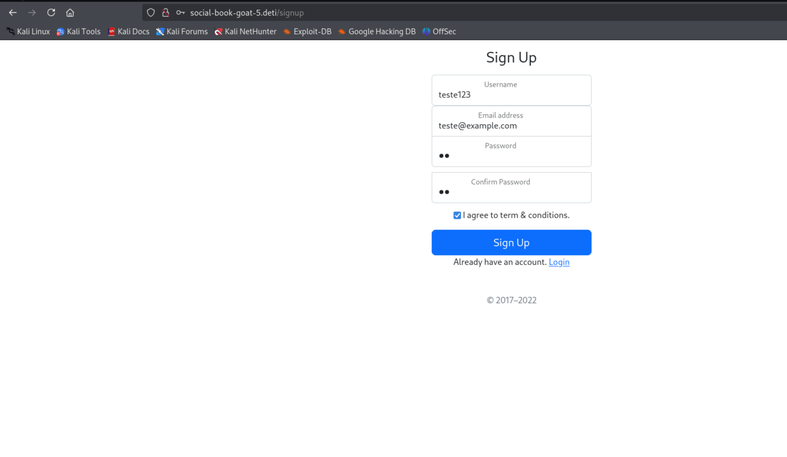
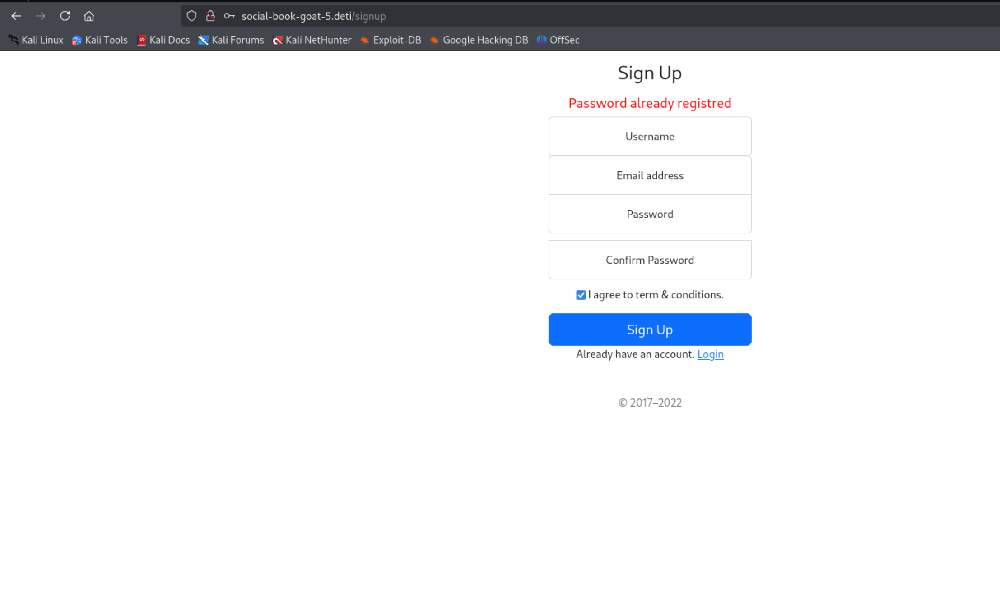
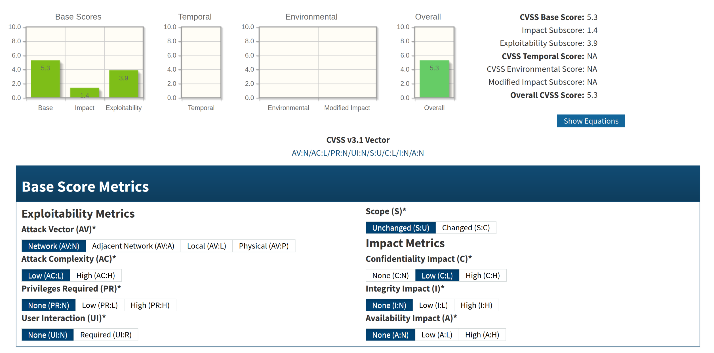
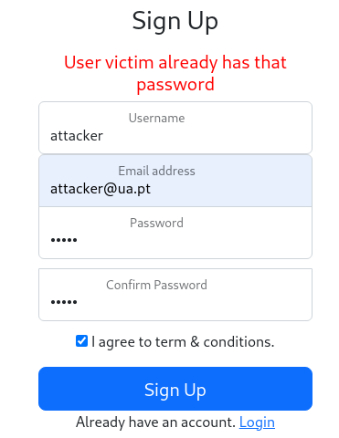
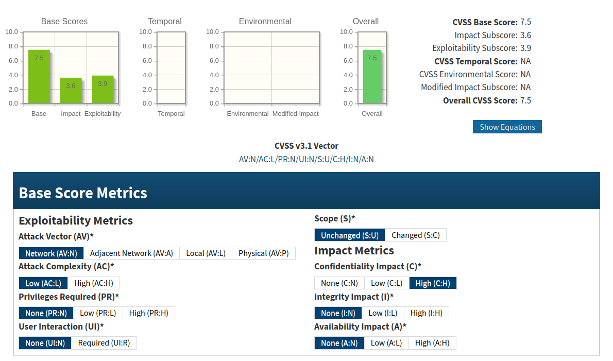

# Information Leakage

## Group 5

### Description

The vulnerability is present when a user signs up with a password that is already being used and there is feedback telling so, as shown by the following images:

### Impact

The vulnerability exposes sensitive information about the system's password database. Specifically, the application reveals whether a password is already in use. This can result in:

1. Password Enumeration:
   - An attacker could exploit this feedback to test a list of commonly used passwords, confirming which ones are in use.
   - This reduces the attacker's effort in brute-forcing accounts, as they now have a list of valid passwords to target.

2. Credential Stuffing Facilitation:
   - Attackers can use this information in combination with known usernames or email addresses to attempt credential stuffing attacks.

### CVSS

**Score:** 5.3

**Vector:** AV:N/AC:L/PR:N/UI:N/S:U/C:L/I:N/A:N

### CWE

- **CWE-203 Observable Discrepancy:** The product behaves differently or sends different responses under different circumstances in a way that is observable to an unauthorized actor, which exposes security-relevant information about the state of the product, such as whether a particular operation was successful or not.

- **CWE-209: Generation of Error Message Containing Sensitive Information:** The error message exposes sensitive details about the system's internal state.

### Recommendations

- Allow users to have the same password
- Use password hashing and salting, preferably using a reputable algorithm like PBKDF2 or Argon2id, this already ensures that there will be no duplicates in the database if that is a concern
- Do not reveal whether a password is already in use
- Encourage strong and unique passwords

## Group 6

### Description

The vulnerability occurs when a new user creates an account and inserts a password that is already being used by another user.
By trying to sign up with those credentials, a message will be displayed showing the account name which is using the repeated password, exposing the credentials of the victim.

### Proof of Concept

1. Create the victim's account with the following credentials:

   - Username: victim
   - Password: 12345

2. Try to create the attacker's account with these credentials:

   - Username: attacker
   - Password: 12345

3. The following information is displayed:

### Impact

The vulnerability exposes users' credentials, violating their confidentiality and privacy while facilitating phishing and credential stuffing attacks.

### CVSS

**Score:** 7.5

**Vector:** AV:N/AC:L/PR:N/UI:N/S:U/C:H/I:N/A:N

### CWE

- **CWE-203 Observable Discrepancy:** The product behaves differently or sends different responses under different circumstances in a way that is observable to an unauthorized actor, which exposes security-relevant information about the state of the product, such as whether a particular operation was successful or not.

- **CWE-209: Generation of Error Message Containing Sensitive Information:** The error message exposes sensitive details about the system's internal state.

- **CWE-521 Weak Password Requirements:** The product does not require that users should have strong passwords, which makes it easier for attackers to compromise user accounts.

### Recommendations

- Remove the password feedback that reveals the user which has the same password
- Correctly validate passwords according to a password security compliance checklist
